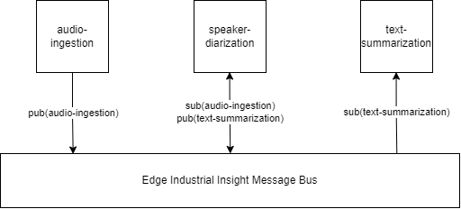
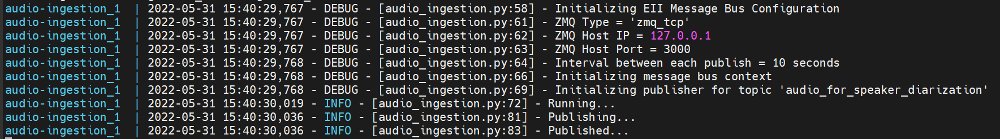
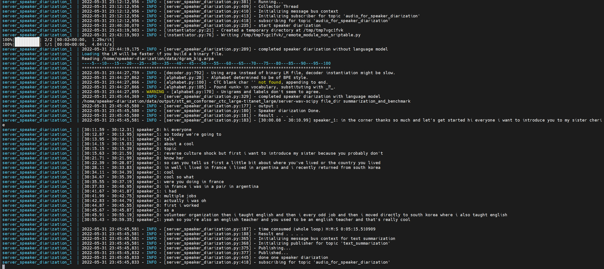
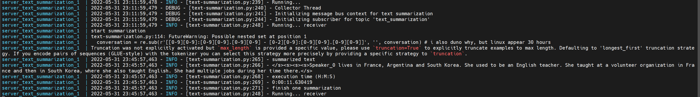
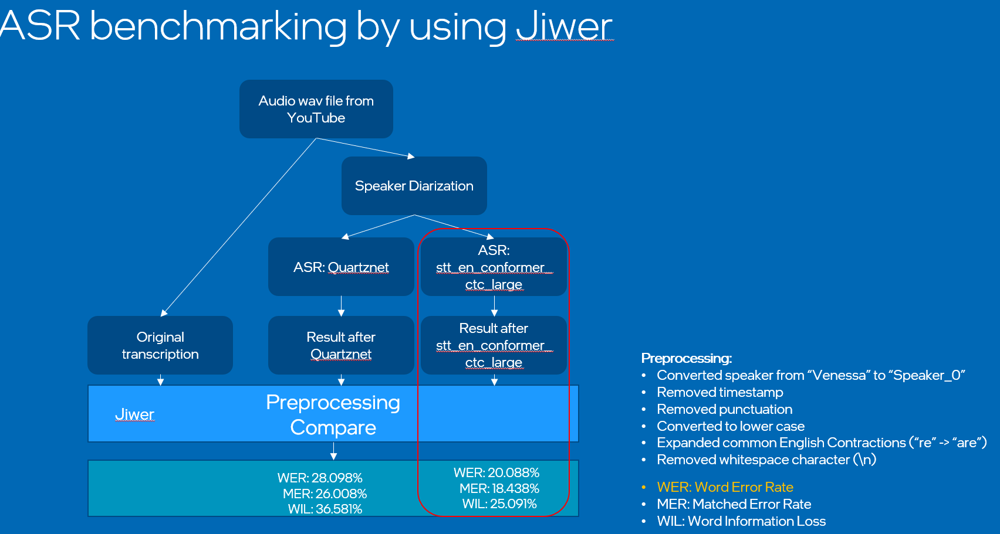

# Audio Summarization


## Contents
- [Architecture Design](#architecture-design)
- [System Requirements](#system-requirements)
- [Disclaimer of Terminal Output](#disclaimer-of-terminal-output)
- [Messsage Bus](#message-bus)
  - [Publishers](#publishers)
  - [Subscribers](#publishers)
- [Module](#Module)
  - [Audio Ingestion](#audio-ingestion)
  - [Speaker Diarization](#speaker-diarization)
  - [Text Summarization](#text-summarization)
- [Run Demo](#run-demo)
- [Configuration](#configuration)
- [Performance / Benchmark support by using own data](#benchmark)
  - [ASR Dialogue](#asr-dialogue)
  - [Summarization (to be implement)](#summarization)
- [References](#references)

## Overview
This is a module of audio summarization. It use the EII message bus as transfer protocol to connect its individual components(audio ingestion, speaker diarization and text summarization). 

## System Requirements
after activate the container, their use version of 
EII 2.6.1

ubuntu:18.04

python 3.8
speaker diarization requirements
TEMPORARY

NEMO (main) (used when it is v1.8.2)

langauge model kenlm (main) (only main during developed)

other requirements.txt may adjust when find a better way to install NEMO and kenlm.

if missing anything, you can explore much deeper through dockerfile of every service ...

## Disclaimer of Terminal Output
The output is used a youtube audio file, extracted to 1 minute. start duaration of 1.00 minute to 2.00 minute. Because of the long dialogue diffuculty to snipper in one image, summarization limitation that not yet eliminate.

## Architecture Design:



## Message Bus
Message bus used is [EII message bus](https://github.com/open-edge-insights/).

### ZeroMQ TCP Configuration
Here, we only use the TCP [ZeroMq](https://github.com/open-edge-insights/eii-messagebus#zeromq-tcp-configuration).

### Publishers
[Publisher](https://github.com/open-edge-insights/eii-messagebus#publishers) is used to publish/send data to the message bus with specific topic. In here, we expect audio data (file->blob) will be published. Then dialogue(text) also will be published.

### Subscribers
[Subscriber](https://github.com/open-edge-insights/eii-messagebus#subscribers) is used to subscribe/get data from the message bus if topic hit. In here, we expect audio data (file->blob) will be receive. Then dialogue(text) also will be receive.

## Module

### Audio Ingestion
Expectation: [filename].wav file exist.
filename can refer to [here](audio-ingestion/original-vistry-ffmpeg-1-minute.wav).

If you have new audio file, 
- Add to audio_files or replace your audio_files with existing audio file

remember if it is a new file, need rebuild the docker image.

Configuration to change audo file name refer [here](#configuration-audio-ingestion)

Process: 
send one audio file to the message bus as publisher.

Tested single publish with 50 MB audio file.

expected output from container text ingestion


### Speaker Diarization

Expectation: message bus have topic X(audio_for_speakeR_diarization)

Process: 
Read audio data through subscriber and run speaker diarization. In the end will send dialogue as publisher to message bus. 

Model Information:
- ASR time stamp with [Nemo Conformer-CTC](https://catalog.ngc.nvidia.com/orgs/nvidia/teams/nemo/models/stt_en_conformer_ctc_large) version History : 1.6.0

- Feature Extraction - [Nemo TitaNet - Large](https://catalog.ngc.nvidia.com/orgs/nvidia/teams/nemo/models/titanet_large) version History V0

Constraint: Now only support 2 speakers. 
VAD decided to use based on ASR.

expected output from container speaker diarization


### Text Summarization

Expectation: message bus have topic Y(text_summarization)

Process: 
Read text through subscriber and run abstractive summarization. In the end only print/save the summarization in container.

Model Summarization
Abstractive Summarization model 

* selected from pretrain bigbird, T5, pegasus, BART.
    * T5 subword <= 512 words
    * bigbird support 4 times of BART and pegasus. But currently trained with dictionary/research paper answer.
    * BART looks like have more information from pegasus

- Fine Tuned by external party. [BART-CNN-SAMSUM-LARGE](https://huggingface.co/philschmid/bart-large-cnn-samsum)

[SAMSUM dataset](/asset/images/samsum-dataset-snippet.png): a dataset consits of daily dialogue and summary of the dialogue.

Constraint: Now only support text ~< 3000 chacracters or 1024(-2) subwords.

expected output from container text summarization


## Run Demo

Start the docker container in reverse way. 

Text Summarization -> Speaker Diarization -> Audio Ingestion.

Notes: if plan to modify the dockerfile or source code. please <i>docker-compose build && docker-compose up</i>. Configuration do not need to rebuild the image (<i>docker-compose build</i>)

### start text summarization

Run from current directory instead of change to audio-ingestion folder.

```
docker-compose -f ./text-summarization/docker-compose.yml up
```

### start speaker diarization

Run from current directory instead of change to audio-ingestion folder.

```
docker-compose -f ./speaker-diarization/docker-compose.yml up
```

### start audio ingestion

Run from current directory instead of change to audio-ingestion folder.

```
docker-compose -f ./audio-ingestion/docker-compose.yml up
```

## Configuration
This section will show the 3 [module](#module) docker-compose.yml. 
A file use as environment value for the container.
### Configuration Audio Ingestion

<br></br>

 Key                 | Value                                                                                         | Default Value   
---------------------|-----------------------------------------------------------------------------------------------|-----------------
 ZMQ_TYPE            | ZMQ Type to be used ("zmq_ipc", "zmq_tcp")                                                    | `zmq_tcp`         
 ZMQ_HOST_IP         | Address/IP of the ZMQ server for the client to establish communication                        | `127.0.0.1`       
 ZMQ_HOST_PORT       | Port of the ZMQ server to which the client will connect/bind                                  | `3000`            
 ZMQ_TOPIC           | ZMQ Topic to enable pub/sub communication between clients                                     | `audio_for_speaker_diarization`   
AUDIO_FILE_PATH      | File Path of audio file                                                                       | `youtube-full-ffmpeg-start_from_1_minute-duration-1-minute.wav`   
PYTHONUNBUFFERED     | enable python print log                                                                       | 1  
<br></br>

### Configuration Speaker Diarization
SD -> [Speaker Diarization](#speaker-diarization)

TS -> [Text Summarization](#text-summarization)
<br></br>

 Key                 | Value                                                                                         | Default Value   
---------------------|-----------------------------------------------------------------------------------------------|-----------------
 ZMQ_TYPE_SD            | ZMQ Type to be used ("zmq_ipc", "zmq_tcp")                                                    | `zmq_tcp`         
 ZMQ_HOST_IP_SD         | Address/IP of the ZMQ server for the client to establish communication                        | `127.0.0.1`       
 ZMQ_HOST_PORT_SD       | Port of the ZMQ server to which the client will connect/bind                                  | `3000`            
 ZMQ_TOPIC_SD           | ZMQ Topic to enable pub/sub communication between clients                                     | `audio_for_speaker_diarization`   
PYTHONUNBUFFERED     | enable python print log                                                                       | 1  
 ZMQ_TYPE_TS            | ZMQ Type to be used ("zmq_ipc", "zmq_tcp")                                                    | `zmq_tcp`         
 ZMQ_HOST_IP_TS         | Address/IP of the ZMQ server for the client to establish communication                        | `127.0.0.1`       
 ZMQ_HOST_PORT_TS       | Port of the ZMQ server to which the client will connect/bind                                  | `3001`            
 ZMQ_TOPIC_TS           | ZMQ Topic to enable pub/sub communication between clients                                     | `text-summarization`   

<br></br>

### Configuration Text Summarization

<br></br>

 Key                 | Value                                                                                         | Default Value   
---------------------|-----------------------------------------------------------------------------------------------|-----------------
 ZMQ_TYPE            | ZMQ Type to be used ("zmq_ipc", "zmq_tcp")                                                    | `zmq_tcp`         
 ZMQ_HOST_IP         | Address/IP of the ZMQ server for the client to establish communication                        | `127.0.0.1`       
 ZMQ_HOST_PORT       | Port of the ZMQ server to which the client will connect/bind                                  | `3001`            
 ZMQ_TOPIC           | ZMQ Topic to enable pub/sub communication between clients                                     | `text-summarization`   
PYTHONUNBUFFERED     | enable python print log                                                                       | 1  
<br></br>


## Benchmark
### ASR dialogue
Benchmark with pictures.

Predicted dialogue by speaker diarization can refer to [asset/benchmark/youtube-full-ffmpeg.txt](asset/benchmark/youtube-full-ffmpeg.txt).

Dialogue expected by the author can refer to [asset/benchmark/youtube-subtitle-author.txt](asset/benchmark/youtube-subtitle-author.txt).

The score, calculate with third party library, Jiwer. By using the Word Error Rate(WER) and preprocess by custom logic, replace speaker name with speaker_0 and speaker_1, remove timestamp, bracket([]), from predicted dialogue. Next, use the common preprocess, remove uncessary confuse phrases, punctuation etc.

The benchmark of WER is: <b>20.088 </b>
input of video source from youtube [Advanced English Conversation About Travel [The Fearless Fluency Club]
](https://www.youtube.com/watch?v=bZYwZDqdsas)

Benmark of ASR flow


### Summarization
ROGUE, not yet implement for evaluate

### References

[[1] NVIDIA, toolkit NEMO, Speaker diarization](https://docs.nvidia.com/deeplearning/nemo/user-guide/docs/en/stable/asr/speaker_diarization/intro.html) 

[[2] Abstractive summarization, BART-large-cnn-samsum, huggingface](https://huggingface.co/philschmid/bart-large-cnn-samsum) 

[[3] Benchmark tool for ASR, WER, JIWER](https://github.com/jitsi/jiwer)
[[4] main research direction regarding summarization](https://www.cs.vassar.edu/~cs395/docs/23.pdf)

[[5] nemo titanet-large, feature extraction](https://catalog.ngc.nvidia.com/orgs/nvidia/teams/nemo/models/titanet_large)

[[6] comparison of pegasus, t5 and bart with same input data. also desribed out of summarization error](https://openreview.net/pdf?id=cjUocqbaCcF )

[[7] reference from intel ai lab, for speaker diarization](https://www.assemblyai.com/blog/top-speaker-diarization-libraries-and-apis-in-2022/)

[[8] paper of conformer-transducer, we used CTC, but it is still the main reference paper regarding its architecture](https://arxiv.org/pdf/2005.08100.pdf
)


