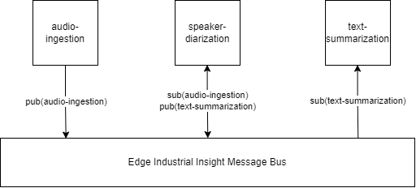
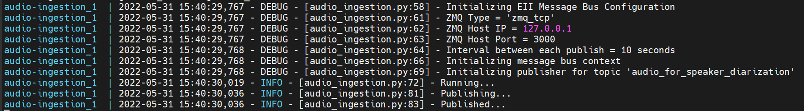
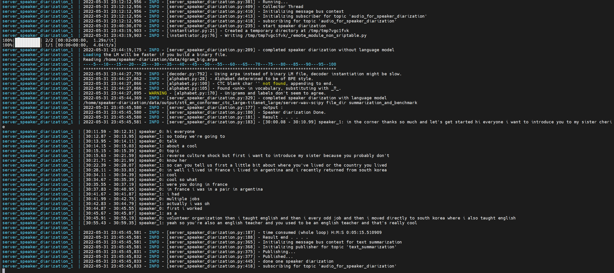

# Audio Summarization


## Contents
- [Architecture Design](#architecture-design)
- [Messsage Bus](#message-bus)
  - [Publishers](#publishers)
  - [Subscribers](#publishers)
- [Module](#Module)
  - [Audio Ingestion](#audio-ingestion)
  - [Speaker Diarization](#speaker-diarization)
  - [Text Summarization](#text-summarization)
- [Run Demo](#run-demo)
- [Configuration](#Configuration)
- [Performance / Benchmark support by using own data](#benchmark)

## Overview
This is a module of audio summarization. It use the EII message bus as transfer protocol to connect its individual components(audio ingestion, speaker diarization and text summarization). 

## Architecture Design:



## Message Bus
Message bus used is [EII message bus](https://github.com/open-edge-insights/).

### ZeroMQ TCP Configuration
Here, we only use the TCP [ZeroMq](https://github.com/open-edge-insights/eii-messagebus#zeromq-tcp-configuration).

### Publishers
[Publisher](https://github.com/open-edge-insights/eii-messagebus#publishers) is used to publish/send data to the message bus with specific topic. In here, we expect audio data (file->blob) will be published. Then dialogue(text) also will be published.

### Subscribers
[Subscriber](https://github.com/open-edge-insights/eii-messagebus#subscribers) is used to subscribe/get data from the message bus if topic hit. In here, we expect audio data (file->blob) will be receive. Then dialogue(text) also will be receive.

## Module

### Audio Ingestion
Expectation: [filename].wav file exist.
filename can refer to [here](audio-ingestion/original-vistry-ffmpeg-1-minute.wav.

If you have new audio file, 
- Add it here and modify dockerfile.
- Change name to one of the filename.

Constraint : Currently if audio file > 255 MB, might broke because not covered.

Configuration to change audo file name refer [here](#configuration-audio-ingestion)

Process: 
send one audio file to the message bus as publisher.

expected output from container text ingestion


### Speaker Diarization

Expectation: message bus have topic X(audio_for_speakeR_diarization)

Process: 
Read audio data through subscriber and run speaker diarization. In the end will send dialogue as publisher to message bus. 

Model Information:
- ASR time stamp with Nemo Conformer-CTC
- Feature Extraction - Nemo TitaNet - Large

Constraint: Now only support 2 speakers. 

expected output from container speaker diarization


### Text Summarization

Expectation: message bus have topic Y(text_summarization)

Process: 
Read text through subscriber and run abstractive summarization. In the end only print/save the summarization in container.

Model Summarization
Abstractive Summarization model 

* selected from pretrain bigbird, T5, pegasus, BART.
    * T5 subword <= 512 words
    * bigbird support 4 times of BART and pegasus. But currently trained with dictionary/research paper answer.
    * BART looks like have more information from pegasus

- Fine Tuned by external party. [BART-CNN-SAMSUM-LARGE](https://huggingface.co/philschmid/bart-large-cnn-samsum)

[SAMSUM dataset](/images-readme/samsum-dataset-snippet.png): a dataset consits of daily dialogue and summary of the dialogue.

Constraint: Now only support text ~< 3000 chacracters or 1024(-2) subwords.

expected output from container text summarization


## Run Demo

Start the docker container in reverse way. 

Text Summarization -> Speaker Diarization -> Audio Ingestion.

Notes: if plan to modify the dockerfile or source code. please <i>docker-compose build && docker-compose up</i>. Configuration do not need to rebuild the image (<i>docker-compose build</i>)

### start text summarization

Run from current directory instead of change to audio-ingestion folder.

```
docker-compose -f ./text-summarization/docker-compose.yml up
```

### start speaker diarization

Run from current directory instead of change to audio-ingestion folder.

```
docker-compose -f ./speaker-diarization/docker-compose.yml up
```

### start audio ingestion

Run from current directory instead of change to audio-ingestion folder.

```
docker-compose -f ./audio-ingestion/docker-compose.yml up
```

## Configuration
This section will show the 3 [module](#module) docker-compose.yml. 
A file use as environment value for the container.
### Configuration Audio Ingestion

<br></br>

 Key                 | Value                                                                                         | Default Value   
---------------------|-----------------------------------------------------------------------------------------------|-----------------
 ZMQ_TYPE            | ZMQ Type to be used ("zmq_ipc", "zmq_tcp")                                                    | `zmq_tcp`         
 ZMQ_HOST_IP         | Address/IP of the ZMQ server for the client to establish communication                        | `127.0.0.1`       
 ZMQ_HOST_PORT       | Port of the ZMQ server to which the client will connect/bind                                  | `3000`            
 ZMQ_TOPIC           | ZMQ Topic to enable pub/sub communication between clients                                     | `audio_for_speaker_diarization`   
AUDIO_FILE_PATH      | File Path of audio file                                                                       | `youtube-full-ffmpeg-start_from_1_minute-duration-1-minute.wav`   
PYTHONUNBUFFERED     | enable python print log                                                                       | 1  
<br></br>

### Configuration Speaker Diarization
SD -> [Speaker Diarization](#speaker-diarization)

TS -> [Text Summarization](#text-summarization)
<br></br>

 Key                 | Value                                                                                         | Default Value   
---------------------|-----------------------------------------------------------------------------------------------|-----------------
 ZMQ_TYPE_SD            | ZMQ Type to be used ("zmq_ipc", "zmq_tcp")                                                    | `zmq_tcp`         
 ZMQ_HOST_IP_SD         | Address/IP of the ZMQ server for the client to establish communication                        | `127.0.0.1`       
 ZMQ_HOST_PORT_SD       | Port of the ZMQ server to which the client will connect/bind                                  | `3000`            
 ZMQ_TOPIC_SD           | ZMQ Topic to enable pub/sub communication between clients                                     | `audio_for_speaker_diarization`   
PYTHONUNBUFFERED     | enable python print log                                                                       | 1  
 ZMQ_TYPE_TS            | ZMQ Type to be used ("zmq_ipc", "zmq_tcp")                                                    | `zmq_tcp`         
 ZMQ_HOST_IP_TS         | Address/IP of the ZMQ server for the client to establish communication                        | `127.0.0.1`       
 ZMQ_HOST_PORT_TS       | Port of the ZMQ server to which the client will connect/bind                                  | `3001`            
 ZMQ_TOPIC_TS           | ZMQ Topic to enable pub/sub communication between clients                                     | `text-summarization`   

<br></br>

### Configuration Text Summarization

<br></br>

 Key                 | Value                                                                                         | Default Value   
---------------------|-----------------------------------------------------------------------------------------------|-----------------
 ZMQ_TYPE            | ZMQ Type to be used ("zmq_ipc", "zmq_tcp")                                                    | `zmq_tcp`         
 ZMQ_HOST_IP         | Address/IP of the ZMQ server for the client to establish communication                        | `127.0.0.1`       
 ZMQ_HOST_PORT       | Port of the ZMQ server to which the client will connect/bind                                  | `3001`            
 ZMQ_TOPIC           | ZMQ Topic to enable pub/sub communication between clients                                     | `text-summarization`   
PYTHONUNBUFFERED     | enable python print log                                                                       | 1  
<br></br>


## Benchmark
Benchmark with pictures.

